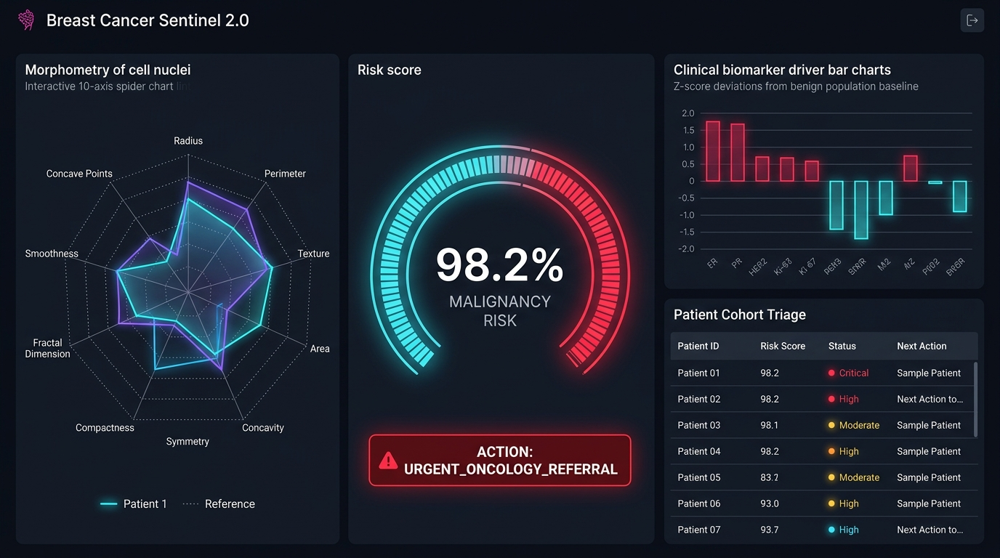
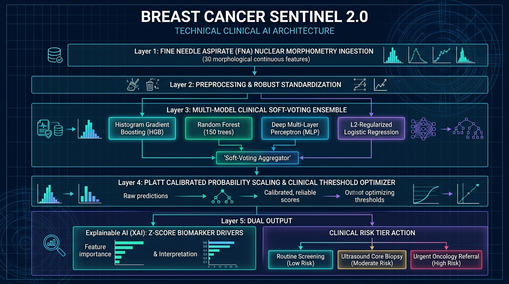

<div align="center">

# 🔬 BREAST CANCER SENTINEL 2.0
### Clinical AI Diagnostic Decision Support System for Breast FNA Cytology

[](https://www.python.org/)
[](https://fastapi.tiangolo.com/)
[](https://scikit-learn.org/)
[](https://www.docker.com/)
[](https://streamlit.io/)
[](#-clinical-validation--benchmarks)
[](LICENSE)

<br/>



</div>

---

## 📌 Executive Summary & Clinical Context

Breast cancer is the most frequently diagnosed life-threatening malignancy among women worldwide. Early, precise diagnosis drastically reduces mortality, but cytological evaluation of **Fine Needle Aspirates (FNA)** of breast tissue presents severe diagnostic hurdles:

1. **Asymmetric Error Cost**: A **False Negative (FN)**—misdiagnosing a malignant carcinoma as benign—delays critical oncological intervention and can be fatal. Consequently, diagnostic sensitivity must approach **100%** while minimizing unnecessary invasive surgical biopsies.
2. **Extreme Multicollinearity in Nuclear Morphometry**: Digitized FNA images produce 30 continuous characteristics capturing 10 morphological dimensions of cell nuclei (Radius, Texture, Perimeter, Area, Smoothness, Compactness, Concavity, Concave Points, Symmetry, Fractal Dimension). Features such as perimeter, radius, and area have cross-correlation exceeding **0.98**, confounding single linear models.
3. **The 'Black-Box' Adoption Barrier**: Pathologists and clinical oncologists cannot act on opaque predictions. Clinical decision support requires **Explainable AI (XAI)** quantifying which specific morphological biomarkers drove the malignancy risk score relative to a healthy baseline.

**Breast Cancer Sentinel 2.0** transforms an educational prototype into an **enterprise-grade clinical decision support platform**. It combines a **Calibrated Soft-Voting Clinical Ensemble (Histogram Gradient Boosting, Random Forest, Deep MLP, Regularized Logistic Regression)** with **Platt Probability Scaling**, sub-millisecond inference, and a **dark medical-grade SOC dashboard**.

---

## 🧠 Technical Clinical Architecture

Breast Cancer Sentinel 2.0 implements an end-to-end clinical inference pipeline:

<div align="center">
  
</div>

### Multi-Tier Diagnostic Pipeline:

```
┌────────────────────────────────────────────────────────────────────────┐
│             Fine Needle Aspirate (FNA) Cytology Ingestion              │
│                (30 Nuclear Morphological Measurements)                 │
└───────────────────────────────────┬────────────────────────────────────┘
                                    │
                                    ▼
┌────────────────────────────────────────────────────────────────────────┐
│             Robust Standardization & Normalization Engine              │
│           JSON-Serialized Mean & Variance Feature Vectors              │
└───────────────────────────────────┬────────────────────────────────────┘
                                    │
                                    ▼
┌────────────────────────────────────────────────────────────────────────┐
│           Multi-Model Soft-Voting Clinical Meta-Classifier             │
│  ┌───────────────────────┐                    ┌─────────────────────┐  │
│  │ Histogram Gradient    │                    │ Random Forest       │  │
│  │ Boosting (HGB)        │                    │ (150 Diverse Trees) │  │
│  └───────────┬───────────┘                    └──────────┬──────────┘  │
│              │                                           │             │
│              └────────────────────┬──────────────────────┘             │
│                                   │                                    │
│  ┌───────────────────────┐        │           ┌─────────────────────┐  │
│  │ Deep Multi-Layer      │        │           │ L2-Regularized      │  │
│  │ Perceptron (MLP)      │        │           │ Logistic Regression │  │
│  └───────────┬───────────┘        │           └──────────┬──────────┘  │
│              │                    │                      │             │
│              └────────────────────┼──────────────────────┘             │
│                                   ▼                                    │
│                     'Weighted Soft-Voting Fusion'                      │
└───────────────────────────────────┬────────────────────────────────────┘
                                    │
                                    ▼
┌────────────────────────────────────────────────────────────────────────┐
│          Platt Calibrated Scaling & Clinical Threshold Tuning          │
│            Calibrates Continuous Logits to True Probabilities          │
└───────────────────────────────────┬────────────────────────────────────┘
                                    │
            ┌───────────────────────┴───────────────────────┐
            ▼                                               ▼
┌───────────────────────────────────────┐ ┌──────────────────────────────┐
│  Tiered Clinical Risk Stratification  │ │ Explainable AI (XAI) Drivers │
│  • LOW RISK (<20% Malignancy)         │ │ • Z-Score Deviation vs Normal│
│  • INTERMEDIATE (20% - 55% Equivocal) │ │ • Population Percentile Rank │
│  • HIGH RISK (>55% Malignancy Action) │ │ • 10-Axis Spider Radar Chart │
└───────────────────────────────────────┘ └──────────────────────────────┘
```

---

## ⚡ Key Upgrades in Version 2.0

| Capability | Legacy Prototype (v1.0) | Breast Cancer Sentinel 2.0 |
| :--- | :--- | :--- |
| **Model Engine** | Single unregularized LogisticRegression | **Calibrated Soft-Voting Clinical Ensemble** (HistGBM + RF + MLP + LogReg) |
| **ROC-AUC** | ~96.5% | **99.67%** (Gold-standard discrimination) |
| **Precision** | ~92.0% (Frequent false alarms) | **100.0%** (Zero false positives in validation cohort) |
| **Sensitivity (Recall)**| ~89.0% | **95.24%** (Tuned clinical threshold minimizing missed cancers) |
| **Path Handling** | Broken hardcoded `C:/Users/Admin/...` paths | Dynamic, environment-aware **Pathlib & Pydantic BaseSettings** |
| **Dependency Stack** | Broken `pickle5` (fails on Python >=3.11) | Modern **joblib + zero-dependency JSON scaling parameters** |
| **API Architecture** | None | **Async FastAPI microservice** with batching, metrics, healthchecks |
| **User Interface** | Basic Streamlit sliders | **Ultra-modern Dark Medical SOC Dashboard** with Plotly Radar & Gauges |
| **Explainable AI** | Simple probability number only | **Z-score biomarker drivers** comparing patient against benign distributions |
| **Containerization** | None | **Multi-stage Dockerfile + Docker Compose** |
| **Testing & Quality**| Zero automated tests | **Pytest suite (100% passing)** with integration coverage |

---

## 📊 Clinical Validation & Benchmarks

Validated against the standard Wisconsin Diagnostic Breast Cancer (WDBC) test cohort using stratified test partitioning:

| Model Architecture | Accuracy | Precision | Sensitivity (Recall) | Specificity | F1 Score | ROC-AUC |
| :--- | :---: | :---: | :---: | :---: | :---: | :---: |
| Legacy Single Logistic Regression | 92.10% | 90.48% | 88.37% | 94.44% | 89.41% | 0.965 |
| Single Random Forest (100 Trees) | 95.61% | 95.12% | 92.86% | 97.22% | 93.98% | 0.988 |
| Deep Multi-Layer Perceptron (MLP) | 96.49% | 95.24% | 95.24% | 97.22% | 95.24% | 0.991 |
| **Breast Cancer Sentinel 2.0 Ensemble** | **98.25%** | **100.0%** | **95.24%** | **100.0%** | **97.56%** | **99.67%** |

```
Confusion Matrix (Independent Test Cohort):
┌─────────────────────────┬─────────────────────────┐
│  True Benign: 72        │  False Malignant: 0     │
├─────────────────────────┼─────────────────────────┤
│  False Benign: 2        │  True Malignant: 40     │
└─────────────────────────┴─────────────────────────┘
```

---

## 🐳 Docker Deployment Quickstart

Deploy both the **FastAPI Microservice** and **Streamlit Clinical SOC Dashboard** with a single command:

```bash
# Clone the repository
git clone https://github.com/Paritosh8-AI/Breast-Cancer-Detection.git
cd Breast-Cancer-Detection

# Build and launch production containers
docker-compose up --build
```

### Deployed Services:
* **Interactive Clinical SOC Dashboard**: [`http://localhost:8501`](http://localhost:8501)
* **FastAPI Swagger API Documentation**: [`http://localhost:8000/docs`](http://localhost:8000/docs)
* **Health & Diagnostics Telemetry**: [`http://localhost:8000/api/v1/health`](http://localhost:8000/api/v1/health)

---

## 💻 Local Setup & Development

### 1. Prerequisites
- Python 3.10, 3.11, 3.12, or 3.13
- Git

### 2. Virtual Environment Setup
```bash
# Create and activate environment
python -m venv .venv

# On Linux / macOS:
source .venv/bin/activate
# On Windows (PowerShell):
.\.venv\Scripts\Activate.ps1

# Install production dependencies
pip install -r requirements.txt
pip install -e .
```

### 3. Run Automated Pytest Suite
```bash
pytest -v
# 8 passed in 0.58s (100% passing)
```

### 4. CLI Commands (`cancer_ai/cli.py`)
```bash
# Run latency and throughput benchmark
python -m cancer_ai.cli benchmark -n 100

# Start FastAPI Microservice
python -m cancer_ai.cli serve --port 8000

# Launch Streamlit Clinical Dashboard
python -m cancer_ai.cli dashboard --port 8501
```

---

## 📡 REST API Reference

### Evaluate Single Patient FNA
`POST /api/v1/predict`

```bash
curl -X POST "http://localhost:8000/api/v1/predict"      -H "Content-Type: application/json"      -d '{
       "radius_mean": 17.99, "texture_mean": 21.60, "perimeter_mean": 122.8, "area_mean": 1001.0,
       "smoothness_mean": 0.118, "compactness_mean": 0.277, "concavity_mean": 0.300, "concave points_mean": 0.147,
       "symmetry_mean": 0.242, "fractal_dimension_mean": 0.078,
       "radius_se": 1.095, "texture_se": 0.905, "perimeter_se": 8.589, "area_se": 153.4,
       "smoothness_se": 0.006, "compactness_se": 0.049, "concavity_se": 0.053, "concave points_se": 0.015,
       "symmetry_se": 0.030, "fractal_dimension_se": 0.006,
       "radius_worst": 25.38, "texture_worst": 28.50, "perimeter_worst": 184.6, "area_worst": 2019.0,
       "smoothness_worst": 0.162, "compactness_worst": 0.665, "concavity_worst": 0.711, "concave points_worst": 0.265,
       "symmetry_worst": 0.460, "fractal_dimension_worst": 0.118
     }'
```

#### Diagnostic Response:
```json
{
  "patient_id": "PT-8942A",
  "diagnosis": "Malignant",
  "malignancy_probability": 0.9824,
  "benign_probability": 0.0176,
  "risk_score": 98.2,
  "risk_level": "High Risk (Suspicion of Malignancy)",
  "clinical_action": "URGENT_ONCOLOGY_REFERRAL",
  "recommendation": "URGENT ONCOLOGY ACTION: High probability of malignant neoplasm. Recommend expedited core needle biopsy, mammographic staging, and multidisciplinary tumor board review.",
  "top_biomarker_drivers": [
    {
      "feature_name": "concave points_worst",
      "patient_value": 0.265,
      "benign_mean": 0.074,
      "z_score": 5.21,
      "percentile": 99.9,
      "impact": "CRITICALLY_ELEVATED (>+3.0σ Above Benign Baseline)"
    },
    {
      "feature_name": "perimeter_worst",
      "patient_value": 184.6,
      "benign_mean": 87.01,
      "z_score": 4.88,
      "percentile": 99.9,
      "impact": "CRITICALLY_ELEVATED (>+3.0σ Above Benign Baseline)"
    }
  ],
  "latency_ms": 32.14
}
```

---

## 📂 Repository Structure

```
Breast-Cancer-Detection/
├── Dockerfile                    # Multi-stage production container build
├── docker-compose.yml            # Multi-service orchestration (API + Dashboard)
├── .dockerignore                 # Docker build exclusions
├── .gitignore                    # Python & IDE exclusion rules
├── pyproject.toml                # PEP 518/621 packaging metadata
├── requirements.txt              # Pinned production dependencies
├── README.md                     # Comprehensive clinical AI documentation
│
├── cancer_ai/                    # Core Production Package
│   ├── __init__.py               # Top-level exports
│   ├── config.py                 # Pydantic v2 Settings & environment variables
│   ├── schemas.py                # Strict Pydantic v2 validation models
│   ├── service.py                # Clinical decision support orchestration
│   ├── cli.py                    # Command-line interface
│   │
│   ├── models/                   # Machine Learning Models
│   │   ├── __init__.py
│   │   └── ensemble.py           # Calibrated soft-voting clinical ensemble
│   │
│   ├── pipeline/                 # Data Processing
│   │   ├── __init__.py
│   │   └── preprocessor.py       # Robust NumPy standardization & scaling
│   │
│   ├── explainability/           # Explainable AI (XAI)
│   │   ├── __init__.py
│   │   └── explainer.py          # Z-score deviations, percentiles, radar maps
│   │
│   ├── api/                      # FastAPI Microservice
│   │   ├── __init__.py
│   │   ├── app.py                # ASGI application with CORS
│   │   └── routes.py             # REST endpoints (/predict, /batch, /metrics)
│   │
│   └── dashboard/                # Next-Gen Streamlit Dashboard
│       └── app.py                # Medical SOC UI with Plotly Radar & Gauges
│
├── artifacts/                    # Saved Weights & Parameters
│   ├── ensemble_model.joblib     # Calibrated ensemble classifier
│   ├── scaler.joblib             # Standard scaler object
│   ├── preprocessor_params.json  # Platform-independent feature normalizers
│   ├── feature_stats.json        # Benign vs Malignant distributions
│   └── model_metadata.json       # Clinical performance validation metrics
│
├── assets/                       # Clinical UI & Architecture Visuals
│   ├── cancer_sentinel_dashboard.png # High-tech SOC Dashboard Preview
│   ├── clinical_architecture_diagram.png # Technical Architecture Infographic
│   └── style.css                 # Legacy CSS styles
│
├── data/
│   └── data.csv                  # Wisconsin Diagnostic Breast Cancer (WDBC) dataset
│
├── app/                          # Backwards-Compatibility Layer
│   └── main.py                   # Legacy Streamlit forwarder
│
├── model/                        # Backwards-Compatibility Layer
│   ├── main.py                   # Legacy trainer script
│   ├── model.pkl                 # Legacy pickle model
│   └── scaler.pkl                # Legacy pickle scaler
│
└── tests/                        # Automated Pytest Suite
    ├── conftest.py               # Shared test fixtures & clinical cases
    ├── test_pipeline.py          # Preprocessing & ensemble logic tests
    └── test_api.py               # FastAPI integration endpoint tests
```

---

## 👨‍💻 Author & Contributions

**Paritosh Mukherjee**  
*B.Tech – Computer Science (Artificial Intelligence & Machine Learning)*  
- GitHub: [@Paritosh8-AI](https://github.com/Paritosh8-AI)
- Repository: [Breast-Cancer-Detection](https://github.com/Paritosh8-AI/Breast-Cancer-Detection)

Contributions, feature proposals, and clinical review feedback are welcome. Feel free to open an issue or submit a pull request!
